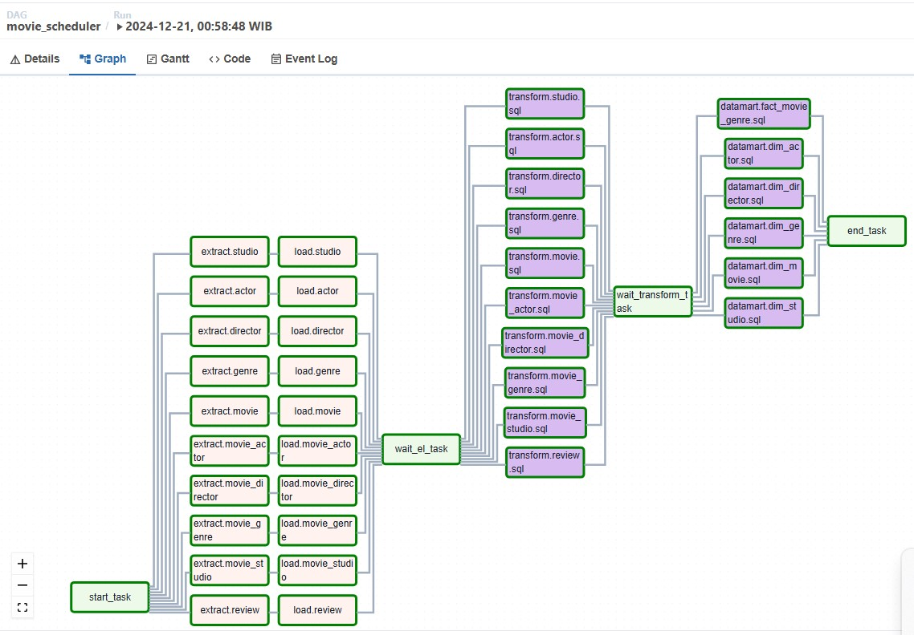
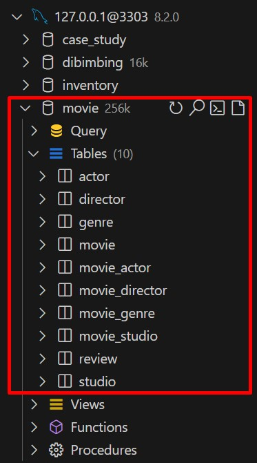
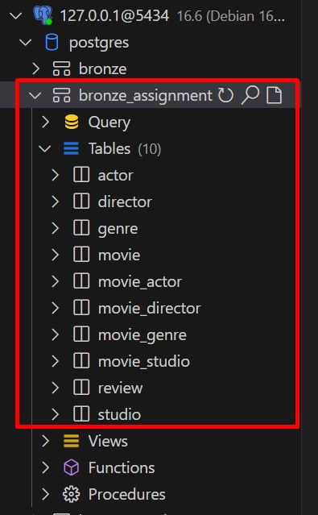
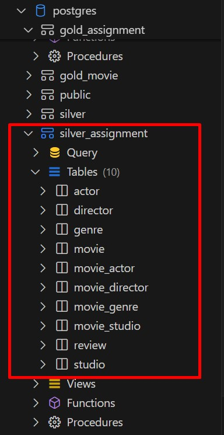
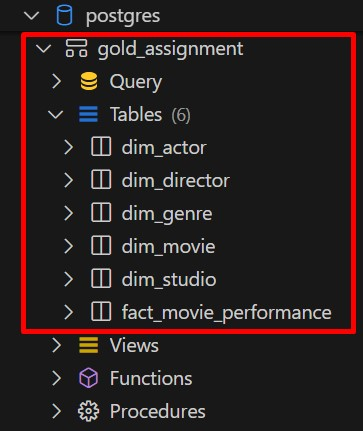

# Movie Scheduler

This project is an Airflow DAG that schedules ETL processes for movie data. The ETL runs every 2 hours from 9 AM to 9 PM every Friday during the first and third weeks of the month. The process involves extracting data from a MySQL database, loading it into a PostgreSQL database, and applying transformations. The data is processed into different stages, including Bronze, Silver, and Gold layers.



## Folder Structure

```bash
movie_scheduler/
│
├── dags/
│   ├── movie_scheduler.py   # Main Airflow DAG
│   ├── resources/
│       ├── config/
│       │   └── assignment.yaml  # Configuration file for tables and parameters
│       └── scripts/
│           ├── assignment/
│           │   ├── extract.py  # Extraction script for MySQL
│           │   └── load.py     # Loading script to PostgreSQL
│       ├── sql/
│           ├── assignment/
│               ├── gold/     # SQL scripts for Gold layer transformation
│               └── silver/   # SQL scripts for Silver layer transformation
│
└── README.md                # Project documentation
```

## Configuration
The configuration for the ETL process is defined in the `assignment.yaml` file located in the `resources/config/` folder. This file specifies the tables to extract, the transformations for the Silver layer, and the datamart definitions for the Gold layer.

.jpg)
.jpg)

## ETL Process

### Extract:
Data is extracted from the MySQL database according to the parameters defined in the assignment.yaml file.



### Load:
The extracted data is loaded into the PostgreSQL database, where it is processed in different layers:
#### Bronze:



Raw data is stored without transformation.

#### Silver:



Data is cleaned and enriched using the transformations defined in the silver SQL files.

#### Gold:



Transformed data is used to create dimensional tables and fact tables for reporting and analytics.


### Key Updates:

1. **`assignment.yaml` Configuration**: Added sections for tables, transformations, and datamart based on the YAML structure you provided.
2. **Transformation and Datamart Sections**: These now specify the SQL files that handle the Silver and Gold layer transformations.
3. **Detailed ETL Process**: Updated to reflect the table extraction, transformation into Silver layer, and creation of Gold layer for reporting.

Let me know if you need further adjustments!